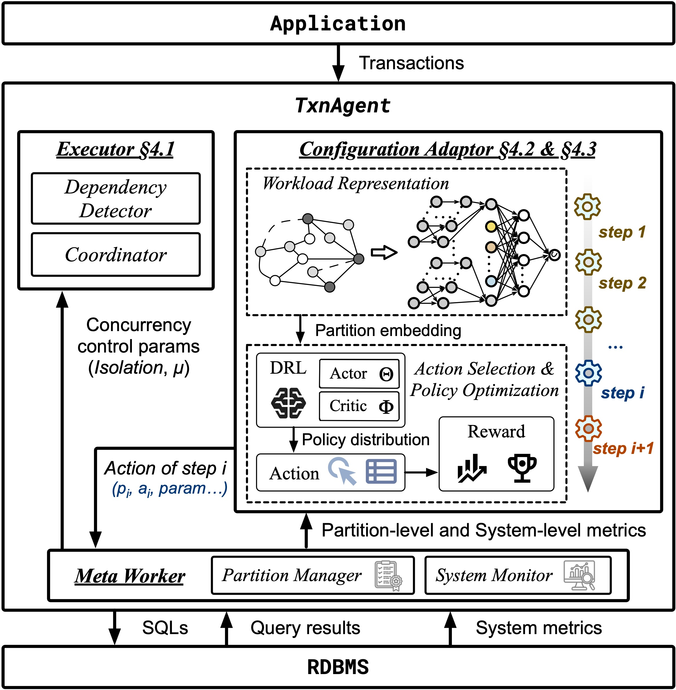

# TxnAgent

The code base of TxnAgent: Achieving Serializable **Transaction** Scheduling with **S**elf-**A**daptive **I**solation **L**evel **S**election.

## Brief Introduction

TxnAgent works in the middle tier between database and application. It meets three requirements:
1. It requires minimal modifications to client applications and database kernels, ensuring low implementation overhead.
2. It must be efficient to handle dangerous structures under various lower isolation levels while ensuring SER.
3. It must adaptively select the optimal isolation level to maximize performance in response to dynamic workloads.

<div align=center>

</div>

## Code Navigation

Key modules and corresponding source code:

| Module | Source Files |
|--------|-------------|
| **Analyzer** | `src/.../worker/OfflineWorker`, `src/.../analysis/*` |
| **Executor** | `src/.../worker/OnlineWorker`, `src/.../execution/validation/*` |
| **Adapter** | `src/.../worker/{Adapter, Flusher}`, `src/.../execution/sample/*` |
| **RL Agent** | `agent/agent.py`, `agent/rl_model.py`, `adapter.py` |
| **Partition** | `src/.../execution/isolation/PartitionManager.java`, `PartitionConfig.java` |

> Note: `...` represents the filepath `main/java/org/dbiir/txnsails`.

## Prerequisites

- **JDK 21** and **Gradle 9+**
- **Python 3.9+** with packages: `torch`, `numpy`, `tensorboard`
- **PostgreSQL 15+** (with data pre-loaded for your benchmark)

## How to Build

```shell
./gradlew build
```

The fat jar will be placed at `build/libs/TxnSailsServer-fat-2.0-all.jar`.

## Deployment

### Architecture

```
┌────────────┐  TCP :7654  ┌───────────────────┐  TCP :9876  ┌────────────┐
│  adapter.py │◄────────────│  TxnSailsServer   │◄────────────│   Client   │
│  (RL Agent) │────────────►│  (Java Server)     │────────────►│  (TriStar) │
└────────────┘  actions     │  StatisticsWorker  │  txn reqs   └────────────┘
                            └───────────────────┘
```

**Startup order matters**: the adapter must be listening before the server starts (StatisticsWorker connects to the adapter on init).

### Step 1: Start the RL Agent (adapter)

```shell
python3 adapter.py -w ycsb
```

This starts the Python RL agent, which:
- Initializes the MAML-based PPO model
- Loads a pre-trained checkpoint from `models/best_meta_ppo.pt` (if available)
- Listens on **port 7654** for the Java `StatisticsWorker` connection

**Arguments:**
| Flag | Description |
|------|-------------|
| `-w`, `--workload` | **Required**. Workload name: `ycsb`, `tpcc`, or `smallbank` |
| `-f`, `--filepath` | Optional. File path for offline training data |
| `-p`, `--phase` | Optional. `offline` or `online` (default: online) |

### Step 2: Start TxnAgentServer

```shell
java -jar build/libs/TxnAgentServer-fat-2.0-all.jar \
    -c config/ycsb.xml \
    -s config/ycsb.sql \
    -t config/partition/ycsb/partition.yaml \
    -p online
```

This starts the Java server, which:
- Loads the workload configuration from the XML file
- Initializes `PartitionManager` with partition layout from the YAML file
- Starts `StatisticsWorker` (connects to the adapter on port 7654)
- Listens on **port 9876** for client connections

**Arguments:**
| Flag | Description |
|------|-------------|
| `-c`, `--config` | **Required**. Workload XML configuration file |
| `-s`, `--schema` | **Required**. Database schema SQL file |
| `-t`, `--partition` | Partition configuration YAML file (enables partitioning) |
| `-d`, `--directory` | Base directory for result/meta files |
| `-p`, `--phase` | `online` (RL-driven) or `offline` (static stages) |

### Step 3: Run the Client

Use your benchmark client (e.g., TriStar) to connect to port 9876 and send workload:

```shell
java -cp target/tristar/tristar/lib/ -jar target/tristar/tristar/tristar.jar \
    -b ycsb \
    -c config/ycsb/hotspot-128/postgresql/ycsb_cc_FS.xml \
    --execute=true \
    -d results/ycsb/hotspot-128
```

### Partition Configuration

There are two modes controlled by whether the YAML file contains `stages`:

**Online mode** (RL agent controls isolation levels — no `stages`):
```yaml
workload:
  name: ycsb
  scalaFactor: 1000
  relations:
    - name: usertable
      partitionSize: 1000
      partitionCount: 1000
```

## Automated Test Runner

For running full test suites (adapter → server → client lifecycle), use:

```shell
python3 run_tests.py -w ycsb -e postgresql -f skew-128
```

See `python3 run_tests.py -h` for all options.
